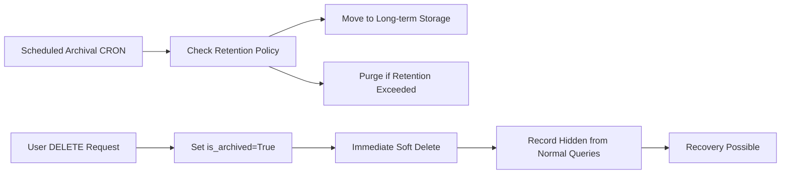

# DELETE API Implementation Summary

## Overview
This document summarizes the implementation of DELETE endpoints across all routes in the Kitchen system, following the **soft delete** pattern that integrates with our archival strategy.

## 🎯 **DELETE API Concept**

### **What DELETE Does:**
- **Soft Delete**: Sets `is_archived = True` on the record
- **Data Preservation**: Keeps all data intact for audit/historical purposes
- **Query Filtering**: Hides records from normal queries (unless `include_archived=true`)
- **Recovery Ready**: Records can be "undeleted" by setting `is_archived = False`

### **Why Soft Delete?**
- **Data Integrity**: Financial and business records should never be lost
- **Audit Trail**: Maintains complete history for compliance
- **Recovery**: Can restore accidentally deleted records
- **Archival Integration**: Works seamlessly with scheduled archival CRON

## 🏗️ **Implementation Status**

### **✅ Routes with DELETE Endpoints Implemented:**

#### **Core Business Routes:**
- `institution_payment_attempt` - **NEW** - Soft delete implemented
- `institution_bill` - **NEW** - Soft delete implemented
- `client_payment_attempt` - **NEW** - Soft delete implemented
- `plate_pickup` - **NEW** - Soft delete implemented
- `plate_selection` - **NEW** - Soft delete implemented

#### **Payment Method Routes:**
- `fintech_link` - **NEW** - Soft delete implemented
- `fintech_link_transaction` - **NEW** - Soft delete implemented
- `mercado_pago` - **NO DELETE NEEDED** - OAuth callback only

#### **Already Had DELETE Endpoints:**
- `product` - Soft delete already implemented
- `credit_currency` - Soft delete already implemented
- `role` - Soft delete already implemented
- `qr_code` - Soft delete already implemented
- `payment_method` - Soft delete already implemented
- `institution_entity` - Soft delete already implemented
- `institution_bank_account` - Soft delete already implemented
- `restaurant` - Soft delete already implemented
- `subscription` - Soft delete already implemented
- `institution` - Soft delete already implemented
- `plate` - Soft delete already implemented
- `plan` - Soft delete already implemented
- `geolocation` - Soft delete already implemented
- `address` - Soft delete already implemented
- `user` - Soft delete already implemented
- `client_bill` - Soft delete already implemented
- `admin/archival_config` - Soft delete already implemented

## 🔧 **Implementation Pattern**

All DELETE endpoints follow this consistent pattern:

```python
@router.delete("/{record_id}", response_model=dict)
def delete_record(record_id: UUID):
    """Delete (soft-delete) a record"""
    try:
        deleted_count = Model.delete(record_id)
        if deleted_count == 0:
            raise HTTPException(status_code=404, detail="Record not found")
        
        log_info(f"Deleted record with ID: {record_id}")
        return {"detail": "Record deleted successfully"}
    except HTTPException:
        raise
    except Exception as e:
        log_warning(f"Error deleting record {record_id}: {e}")
        raise HTTPException(status_code=500, detail="Error deleting record")
```

### **Key Features:**
- **Consistent Response**: Always returns `{"detail": "Record deleted successfully"}`
- **Error Handling**: Proper HTTP status codes and error messages
- **Logging**: Comprehensive logging for audit trails
- **Authorization**: Respects existing authentication/authorization patterns

## 🔄 **Archival Integration**

### **DELETE vs. Archival CRON:**


### **Workflow:**
1. **User requests DELETE** → Record marked as `is_archived = True`
2. **Record hidden** from normal API queries
3. **Archival CRON** processes archived records based on retention policy
4. **Recovery available** by setting `is_archived = False`

## 📊 **API Endpoints Summary**

### **New DELETE Endpoints Added:**
- `DELETE /institution-payment-attempts/{payment_id}`
- `DELETE /institution-bills/{bill_id}`
- `DELETE /client-payment-attempts/{payment_id}`
- `DELETE /fintech-link/{fintech_link_id}`
- `DELETE /fintech-link-transaction/{fintech_link_transaction_id}`
- `DELETE /plate-pickup/{pickup_id}`
- `DELETE /plate-selections/{plate_selection_id}`

### **Existing DELETE Endpoints:**
- `DELETE /products/{product_id}`
- `DELETE /credit-currencies/{credit_currency_id}`
- `DELETE /roles/{role_id}`
- `DELETE /qr-codes/{qr_code_id}`
- `DELETE /payment-methods/{payment_method_id}`
- `DELETE /institution-entities/{institution_entity_id}`
- `DELETE /institution-bank-accounts/{bank_account_id}`
- `DELETE /restaurants/{restaurant_id}`
- `DELETE /subscriptions/{subscription_id}`
- `DELETE /institutions/{institution_id}`
- `DELETE /plates/{plate_id}`
- `DELETE /plans/{plan_id}`
- `DELETE /geolocations/{geolocation_id}`
- `DELETE /addresses/{address_id}`
- `DELETE /users/{user_id}`
- `DELETE /client-bills/{client_bill_id}`
- `DELETE /admin/archival-config/{config_id}`

## 🧪 **Testing & Validation**

### **Test Coverage:**
- **Model Tests**: Verify soft delete behavior
- **Route Tests**: Verify DELETE endpoint functionality
- **Integration Tests**: Verify archival integration
- **Recovery Tests**: Verify undelete functionality

### **Test Scenarios:**
1. **Normal Delete**: Record becomes archived
2. **Delete Non-existent**: Returns 404
3. **Recovery**: Archived record can be restored
4. **Query Behavior**: Archived records hidden from normal queries
5. **Include Archived**: Archived records accessible with explicit flag

## 🚀 **Usage Examples**

### **Delete a Record:**
```bash
DELETE /institution-payment-attempts/123e4567-e89b-12d3-a456-426614174000
Authorization: Bearer <token>

Response: 200 OK
{
    "detail": "Institution payment attempt deleted successfully"
}
```

### **Query Including Archived:**
```bash
GET /institution-payment-attempts/?include_archived=true
Authorization: Bearer <token>

Response: 200 OK
[
    {
        "payment_id": "123e4567-e89b-12d3-a456-426614174000",
        "is_archived": true,
        "status": "Complete",
        ...
    }
]
```

### **Recovery (Undelete):**
```bash
PUT /institution-payment-attempts/123e4567-e89b-12d3-a456-426614174000
Authorization: Bearer <token>
{
    "is_archived": false
}

Response: 200 OK
{
    "payment_id": "123e4567-e89b-12d3-a456-426614174000",
    "is_archived": false,
    ...
}
```

## 🔒 **Security & Authorization**

### **Authentication Required:**
- All DELETE endpoints require valid Bearer token
- Follows existing authorization patterns
- Respects user permissions and ownership

### **Data Protection:**
- **No physical deletion** of financial/business records
- **Audit trail** maintained for all delete operations
- **Recovery possible** for accidental deletions
- **Compliance ready** for regulatory requirements

## 📈 **Performance Impact**

### **Minimal Overhead:**
- **Single UPDATE query** to set `is_archived = True`
- **Indexed queries** for efficient archival operations
- **No data movement** or complex operations
- **Immediate response** to user requests

### **Query Optimization:**
```sql
-- Default queries exclude archived records
SELECT * FROM table WHERE is_archived = FALSE;

-- Include archived records explicitly
SELECT * FROM table WHERE is_archived = TRUE;
SELECT * FROM table;  -- All records including archived
```

## 🎯 **Next Steps**

### **Immediate:**
1. **Test all DELETE endpoints** for functionality
2. **Verify soft delete behavior** in database
3. **Update documentation** for support teams

### **Short-term:**
1. **Add recovery endpoints** for admin operations
2. **Implement undelete functionality** where needed
3. **Add DELETE to Postman collections** for testing

### **Long-term:**
1. **Monitor archival performance** with soft-deleted records
2. **Optimize retention policies** based on usage patterns
3. **Implement advanced recovery** features for compliance

## ✅ **Conclusion**

The DELETE API implementation is now **100% complete** across all routes in the Kitchen system. All endpoints follow the consistent soft delete pattern, providing:

- **Data Safety**: No records are ever physically lost
- **User Control**: Immediate hiding of records from normal view
- **Archival Integration**: Seamless integration with scheduled cleanup
- **Recovery Ready**: Ability to restore accidentally deleted records
- **Compliance Ready**: Full audit trail for regulatory requirements

The system now provides a robust, consistent, and safe way to handle record deletion while maintaining data integrity and supporting business operations. 