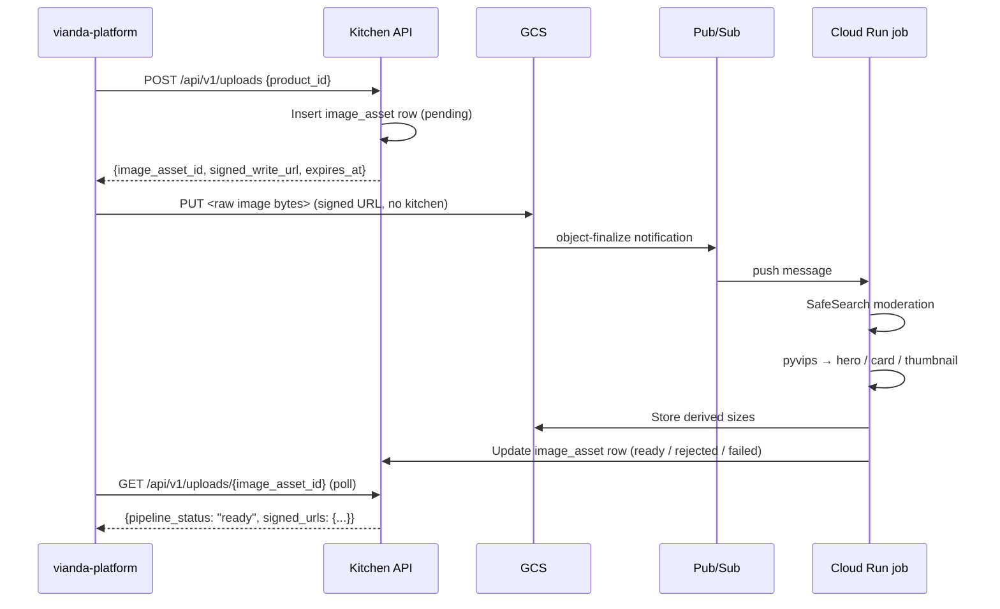

# Image Upload Pipeline – B2B Client Guide

**Last Updated**: 2026-05  
**Audience**: vianda-platform (Suppliers, Internal employees) – product image management

---

## 1. Overview

Product images flow through an asynchronous two-step pipeline:

1. The client calls `POST /api/v1/uploads` to register an upload intent. Kitchen inserts an `ops.image_asset` row and returns a signed PUT URL pointing directly to GCS.
2. The client PUTs the raw image file to GCS using that URL. Kitchen is not involved in the transfer.
3. GCS fires an object-finalize notification to a Pub/Sub topic. A Cloud Run job receives the push message, runs Cloud Vision SafeSearch moderation, and (if passed) uses pyvips to produce three derived sizes (hero, card, thumbnail) in WebP + JPEG formats.
4. The row's `pipeline_status` flips to `ready` (or `rejected`/`failed`). The client polls `GET /api/v1/uploads/{image_asset_id}` until the status settles.

**Expected latency:** a few seconds under normal load. Longer if Vision API is slow or if Pub/Sub delivery is delayed. Abort the poll at 30 s and surface a friendly error to the user.



---

## 2. Endpoints

### POST /api/v1/uploads

Initiate a new product image upload.

**Auth:** Bearer token. Supplier Admin or Internal employee.  
**Scope:** Suppliers may only upload images for products belonging to their own institution.

**Request body** (`application/json`):

| Field | Type | Required | Description |
|-------|------|----------|-------------|
| `product_id` | UUID | Yes | The product this image belongs to. |

**Example:**
```bash
curl -X POST "https://api.vianda.market/api/v1/uploads" \
  -H "Authorization: Bearer <token>" \
  -H "Content-Type: application/json" \
  -d '{"product_id": "018f1234-0000-7000-8000-000000000001"}'
```

**Response 201:**
```json
{
  "image_asset_id": "018f5678-0000-7000-8000-000000000002",
  "signed_write_url": "https://storage.googleapis.com/vianda-supplier/products/.../original?X-Goog-Signature=...",
  "expires_at": "2026-05-01T12:15:00Z"
}
```

| Field | Type | Description |
|-------|------|-------------|
| `image_asset_id` | UUID | Row identifier — use this to poll status. |
| `signed_write_url` | string | Signed PUT URL for direct GCS upload. Valid until `expires_at`. |
| `expires_at` | datetime (UTC) | Expiry of the signed URL. |

**After receiving the response**, PUT the image directly to GCS:
```bash
curl -X PUT -T ./product.jpg \
  -H "Content-Type: image/jpeg" \
  "$SIGNED_WRITE_URL"
```
No `Authorization` header on the GCS PUT — the signature is embedded in the URL.

**Replace semantics:** if an `image_asset` row already exists for the product, the old GCS blobs are purged and the row deleted before a new row and signed URL are created. The caller does not need to call DELETE first.

**Idempotency:** not idempotent — each call creates a new `image_asset_id` and a new signed URL.

**Error responses:**

| Code | Error code | Condition |
|------|-----------|-----------|
| 404 | `upload.product_not_found` | No active product with the given `product_id`. |
| 403 | `upload.access_denied` | Product belongs to a different institution than the caller. |
| 500 | `upload.signed_url_failed` | GCS signed-URL generation failed (transient). Retry. |

---

### GET /api/v1/uploads/{image_asset_id}

Poll the pipeline status of an image asset.

**Auth:** Bearer token. Supplier Admin or Internal employee.  
**Scope:** Suppliers may only query assets for their own institution's products.

**Path param:** `image_asset_id` — UUID returned by `POST /uploads`.

**Example:**
```bash
curl "https://api.vianda.market/api/v1/uploads/018f5678-0000-7000-8000-000000000002" \
  -H "Authorization: Bearer <token>"
```

**Response 200:**
```json
{
  "image_asset_id": "018f5678-0000-7000-8000-000000000002",
  "product_id": "018f1234-0000-7000-8000-000000000001",
  "pipeline_status": "ready",
  "moderation_status": "passed",
  "signed_urls": {
    "hero": "https://storage.googleapis.com/.../hero?X-Goog-Signature=...",
    "card": "https://storage.googleapis.com/.../card?X-Goog-Signature=...",
    "thumbnail": "https://storage.googleapis.com/.../thumbnail?X-Goog-Signature=..."
  }
}
```

`signed_urls` is `null` for any status other than `ready`. `product_id` is always returned so clients holding only an `image_asset_id` can route back to the owning product without a separate query.

**Error responses:**

| Code | Error code | Condition |
|------|-----------|-----------|
| 404 | `upload.not_found` | No row with that `image_asset_id`. |
| 403 | `upload.access_denied` | Asset belongs to a different institution. |

---

### DELETE /api/v1/uploads/{image_asset_id}

Delete an image asset: purge all GCS blobs then remove the DB row.

**Auth:** Bearer token. Supplier Admin or Internal employee.  
**Scope:** Suppliers may only delete assets for their own institution's products.

**Path param:** `image_asset_id` — UUID returned by `POST /uploads`.

**Example:**
```bash
curl -X DELETE \
  "https://api.vianda.market/api/v1/uploads/018f5678-0000-7000-8000-000000000002" \
  -H "Authorization: Bearer <token>"
```

**Response 204:** No body.

GCS purge is best-effort — individual blob 404s (e.g. if the pipeline failed before writing derived sizes) are silently ignored.

**Error responses:**

| Code | Error code | Condition |
|------|-----------|-----------|
| 404 | `upload.not_found` | No row with that `image_asset_id`. |
| 403 | `upload.access_denied` | Asset belongs to a different institution. |

---

## 3. Status State Machine

### `pipeline_status`

| Status | Meaning | Triggers |
|--------|---------|---------|
| `pending` | Row created; waiting for GCS upload + Pub/Sub message. | `POST /uploads` inserts the row. |
| `processing` | Cloud Run job received the message; moderation + resize in progress. | Cloud Run job starts processing. |
| `ready` | All three derived sizes written to GCS; signed URLs available. | Moderation passed + pyvips succeeded. |
| `rejected` | Image failed SafeSearch moderation. No derived sizes. Original purged. | Any of adult/violence/racy at or above `MODERATION_REJECT_LIKELIHOOD`. |
| `failed` | Transient processing failures exceeded retry limit (3). | `failure_count >= 3` after consecutive 5xx returns from the Cloud Run job. |

### `moderation_status`

| Status | Meaning |
|--------|---------|
| `pending` | SafeSearch not yet run. |
| `passed` | All signals below the rejection threshold. |
| `rejected` | At least one signal at or above the threshold. |

`moderation_status` stays `pending` when `pipeline_status` is `failed` (moderation never ran or the failure was pre-moderation). Both fields are present on every GET response regardless of status.

---

## 4. Polling Guidance

Poll `GET /api/v1/uploads/{image_asset_id}` after putting the file to GCS:

- Start polling ~2 s after the GCS PUT completes.
- Use exponential backoff: 2 s, 4 s, 8 s, …
- Stop at 30 s total and surface a "processing is taking longer than expected — try refreshing later" message.
- Terminal states are `ready`, `rejected`, and `failed` — stop polling once you see any of them.

The canonical polling implementation is the vianda-platform `useImageUpload` hook (once it ships). Until then, the recommendation above is the reference.

---

## 5. Replace Flow

To replace an existing product image:

1. Call `POST /api/v1/uploads` with the same `product_id`. Kitchen automatically purges the old row and GCS blobs and returns a new `image_asset_id` + signed URL. No DELETE call needed.
2. PUT the new image to the new signed URL.
3. Poll the new `image_asset_id` until `ready`.

There is a unique constraint on `product_id` in `ops.image_asset`. At most one image asset row exists per product at any time.

---

## 6. Consuming Derived Sizes

When `pipeline_status` is `ready`, `signed_urls` contains three keys:

| Key | Dimensions | Use |
|-----|-----------|-----|
| `hero` | 1600 × 1066 px (WebP) | Product detail page, large modal |
| `card` | 600 × 400 px (WebP) | Product list cards, B2B product grid |
| `thumbnail` | 200 × 200 px (WebP) | Compact list rows, small thumbnails |

Choose the smallest size that fits the viewport. Using `thumbnail` where `card` is shown wastes nothing and avoids the 1600 px payload on mobile connections.

`original` is a private GCS blob and is never returned via `signed_urls`. It is retained as the source of truth for future backfill re-processing.

**JPEG fallbacks:** JPEG versions of each size are stored in GCS alongside the WebP blobs (e.g. `hero.jpg`, `card.jpg`, `thumbnail.jpg`). The `get_image_asset_signed_urls()` helper does not yet surface them — only WebP keys are returned. Browser/platform JPEG fallback is a follow-up item.

Signed read URLs expire according to `GCS_SIGNED_URL_EXPIRATION_SECONDS`. Re-fetch `GET /uploads/{id}` to get fresh URLs when they expire.

---

## 7. Moderation Behavior

The Cloud Run job runs [Cloud Vision SafeSearch](https://cloud.google.com/vision/docs/detecting-safe-search) on every uploaded image. It evaluates three signal categories:

| Signal | What it detects |
|--------|----------------|
| `adult` | Nudity and sexually explicit content |
| `violence` | Blood, injury, weapons, graphic violence |
| `racy` | Suggestive but not explicit content |

If any signal's likelihood is at or above `MODERATION_REJECT_LIKELIHOOD` (default `LIKELY`, configurable per environment), the image is rejected:

- `pipeline_status` → `rejected`
- `moderation_status` → `rejected`
- `moderation_signals` JSONB column records all signal values for audit (not surfaced via API)
- The original GCS blob is purged
- No derived sizes are produced

The supplier sees `pipeline_status: "rejected"` on the next poll. The platform should show a clear message explaining that the image could not be processed due to content policy and invite the supplier to upload a different image.

---

## 8. Security & Scoping

All three endpoints share the same scoping rules:

- **Internal employees** (`role_type: Internal`) have global access — they can manage image assets for any institution.
- **Supplier Admins** (`role_type: Supplier, role_name: Admin`) are scoped via `InstitutionScope` (`app/security/scoping.py`). Any attempt to access a product or asset belonging to a different institution returns **403 `upload.access_denied`**.

The scoping check uses `EntityScopingService.get_scope_for_entity(ENTITY_PRODUCT, current_user)` — the same mechanism used by the product CRUD endpoints.

---

## 9. Operational Notes

### Pub/Sub redelivery

The Cloud Run job returns:
- `204` on success or permanent failure (malformed path, product not found) → Pub/Sub acknowledges and does **not** redeliver.
- `5xx` on transient failure → Pub/Sub redelivers.

On each transient failure, `failure_count` is incremented. When `failure_count >= 3`, `pipeline_status` flips to `failed` and subsequent redeliveries are silently acked (treated as permanent failures) to prevent infinite retry.

### Backfill mode

`PROCESSING_VERSION = 1` is the current processing standard (defined in `app/workers/image_pipeline/processing.py`). Bumping this constant causes `run_image_backfill()` to re-process all rows where `processing_version < PROCESSING_VERSION`. Backfill always forces re-processing, including already-`ready` rows. Trigger via Cloud Run job with `RUN_MODE=image_backfill`.

### Container dispatch (`RUN_MODE`)

| Value | Behavior |
|-------|---------|
| `api` (default) | FastAPI via uvicorn |
| `image_event` | Pub/Sub push listener (port `PORT`, default 8080) |
| `image_backfill` | Batch re-processor — exits 0 on completion |
