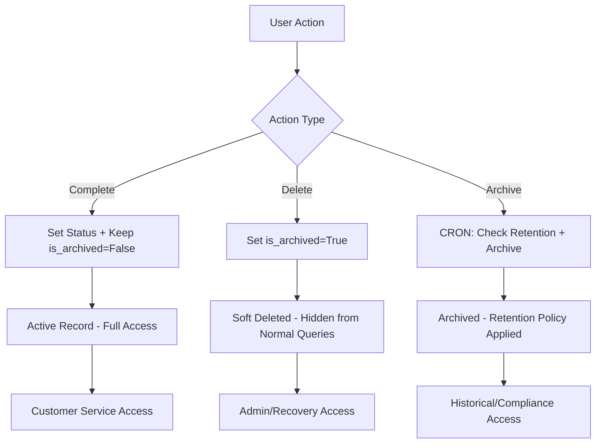

# Archival Strategy & Best Practices

## Overview
The `is_archived` field is a critical component of our data lifecycle management. This document outlines the unified approach for handling archival across all entities in the Kitchen system.

## Core Principles

### 1. **Delayed Archival Philosophy**
- ❌ **Never immediately archive completed records**
- ✅ **Always maintain a grace period** for operational needs
- ✅ **Configure retention periods** per entity type
- ✅ **Support customer service** and dispute resolution

### 2. **Retention Periods by Entity**

| Entity Type | Retention Period | Reason |
|-------------|------------------|--------|
| `vianda_pickup_live` | 30 days | Customer service, order issues |
| `restaurant_transaction` | 90 days | Financial disputes, reconciliation |
| `client_transaction` | 90 days | Payment disputes, refunds |
| `subscription_info` | 365 days | Billing cycles, annual reports |
| `client_bill_info` | 365 days | Tax compliance, auditing |
| `user_info` | 2555 days (7 years) | Legal compliance, GDPR |
| `payment_method` | 180 days | Payment processing disputes |

### 3. **Current State vs. Target State**

#### **Current Issues** ❌
```python
# WRONG: Immediate archival
def complete_order():
    update_data = {
        "status": "Complete",
        "is_archived": True,  # ❌ Too soon!
        "completion_time": datetime.now()
    }
```

#### **Target Implementation** ✅
```python
# CORRECT: Status change only, archival handled separately
def complete_order():
    update_data = {
        "status": "Complete",
        "is_archived": False,  # ✅ Keep accessible
        "completion_time": datetime.now()
    }
    # Archival handled by scheduled job based on retention policy
```

## Implementation Strategy

### 4. **Immediate Changes Required**

#### **A. Fix Current Immediate Archival**
- [ ] Update `vianda_pickup_live` completion logic
- [ ] Update `client_transaction` completion logic  
- [ ] Update `restaurant_transaction` completion logic

#### **B. Add Archival Service**
- [ ] Create `app/services/archival.py`
- [ ] Add scheduled archival job
- [ ] Add manual archival endpoints for admin

#### **C. Database Indexes for Archival**
```sql
-- Efficient archival queries
CREATE INDEX idx_orders_archival ON vianda_pickup_live(status, completion_time, is_archived);
CREATE INDEX idx_transactions_archival ON restaurant_transaction(status, completion_time, is_archived);
CREATE INDEX idx_client_transactions_archival ON client_transaction(status, completion_time, is_archived);
```

### 5. **Archival Service Design**

```python
# Proposed archival service structure
class ArchivalService:
    @staticmethod
    def get_eligible_for_archival(entity_type: str) -> List[UUID]:
        """Find records eligible for archival based on retention policy"""
        
    @staticmethod 
    def archive_records(entity_type: str, record_ids: List[UUID]) -> int:
        """Archive specific records"""
        
    @staticmethod
    def run_scheduled_archival() -> Dict[str, int]:
        """Run archival for all entity types - called by cron job"""
```

### 6. **Customer Service Benefits**

#### **Active Period (0-30 days)**
- `is_archived = False` + `status = 'Complete'`
- **Full access** to order details, modifications, refunds
- **Fast queries** on recent data

#### **Grace Period (30-90 days)** 
- `is_archived = False` + `status = 'Complete'`
- **Limited access** via special queries
- **Dispute resolution** capabilities

#### **Archived Period (90+ days)**
- `is_archived = True`
- **Historical access** only
- **Compliance and reporting** purposes

### 7. **Query Patterns**

#### **Standard Operations** (Default: Show Active Only)
```python
# Most common queries exclude archived automatically
active_orders = ViandaPickupLive.get_by_user_and_status(user_id, "Complete", is_archived=False)
```

#### **Customer Service** (Include Recent Archived)
```python
# Last 90 days including archived for customer service
recent_orders = ViandaPickupLive.get_recent_for_support(user_id, days=90)
```

#### **Compliance/Reporting** (Include All)
```python
# Full historical data for compliance
all_transactions = RestaurantTransaction.get_all_for_audit(include_archived=True)
```

### 8. **Configuration Management**

```python
# Centralized in app/config/settings.py
RETENTION_PERIODS = {
    "orders": 30,              # Operational window
    "transactions": 90,        # Financial disputes  
    "subscriptions": 365,      # Annual cycles
    "user_data": 2555,         # Legal compliance
}
```

### 9. **Monitoring & Alerts**

- **Weekly reports** on archival activity
- **Alerts** for failed archival operations
- **Metrics** on retention policy effectiveness
- **Storage savings** from archival

## Migration Plan

### Phase 1: Stop Immediate Archival ⚡ (Critical)
1. Update completion logic to set `is_archived = False`
2. Deploy immediately to stop data loss

### Phase 2: Implement Archival Service 📅 (2 weeks)
1. Create archival service
2. Add retention configuration  
3. Create manual archival endpoints

### Phase 3: Scheduled Archival ⏰ (3 weeks)
1. Add cron job integration
2. Add monitoring and alerts
3. Performance optimization

### Phase 4: Historical Data Cleanup 🗂️ (4 weeks)
1. Manually process existing data
2. Apply retention policies retroactively
3. Validate data integrity

## Success Metrics

- **Customer Service Response Time**: < 30 seconds for active orders
- **Dispute Resolution**: 100% data availability within retention period
- **Storage Optimization**: 60-80% reduction in "hot" data size
- **Query Performance**: < 100ms for standard operations
- **Compliance**: 100% retention policy adherence

---

**Next Action**: Implement Phase 1 immediately to stop data loss from premature archival. 

## DELETE API Concept & Archival Integration

### 7. **DELETE Endpoint Behavior**

All DELETE endpoints in the system implement **soft delete** functionality, which is a critical component of our archival strategy:

#### **What DELETE Does:**
- **Sets** `is_archived = True` on the record
- **Preserves** all data for audit/historical purposes
- **Hides** the record from normal queries (unless `include_archived=true`)
- **Maintains** referential integrity and data relationships

#### **DELETE vs. Archival CRON:**
```python
# DELETE endpoint (immediate soft delete)
@router.delete("/{record_id}")
def delete_record(record_id: UUID):
    deleted_count = Model.delete(record_id)  # Sets is_archived = True
    return {"detail": "Record deleted successfully"}

# Archival CRON (scheduled cleanup)
def run_scheduled_archival():
    # Finds records with is_archived = True that exceed retention period
    # Could potentially move to long-term storage or purge completely
```

### 8. **When to Use DELETE vs. Archival CRON**

#### **Use DELETE When:**
- **User requests** immediate removal from active view
- **Data correction** needs (wrong records, test data)
- **Privacy requests** (GDPR, user deletion)
- **Business logic** requires immediate hiding

#### **Use Archival CRON When:**
- **Retention periods** are exceeded
- **System cleanup** is needed
- **Performance optimization** requires data reduction
- **Compliance requirements** mandate data lifecycle management

### 9. **DELETE API Implementation Pattern**

All routes follow this consistent pattern:

```python
@router.delete("/{record_id}", response_model=dict)
def delete_record(record_id: UUID):
    """Delete (soft-delete) a record"""
    try:
        deleted_count = Model.delete(record_id)
        if deleted_count == 0:
            raise HTTPException(status_code=404, detail="Record not found")
        
        log_info(f"Deleted record with ID: {record_id}")
        return {"detail": "Record deleted successfully"}
    except HTTPException:
        raise
    except Exception as e:
        log_warning(f"Error deleting record {record_id}: {e}")
        raise HTTPException(status_code=500, detail="Error deleting record")
```

### 10. **Archival Workflow Integration**



### 11. **Recovery & Undelete**

Since DELETE is soft delete, records can be recovered:

```python
# Undelete a record
def undelete_record(record_id: UUID):
    update_data = {"is_archived": False}
    success = Model.update(record_id, update_data)
    return success

# Check archived records
def get_archived_records():
    return Model.get_all()  # Includes archived records
```

### 12. **Performance Considerations**

#### **Query Optimization:**
```sql
-- Default queries exclude archived records
SELECT * FROM table WHERE is_archived = FALSE;

-- Include archived records explicitly
SELECT * FROM table WHERE is_archived = TRUE;
SELECT * FROM table;  -- All records including archived
```

#### **Index Strategy:**
```sql
-- Composite index for efficient archival queries
CREATE INDEX idx_table_archival_status ON table(is_archived, status, created_date);

-- Separate index for DELETE operations
CREATE INDEX idx_table_id_archived ON table(record_id, is_archived);
```

## Implementation Status

### **Routes with DELETE Endpoints:**
- ✅ `institution_payment_attempt` - Soft delete implemented
- ✅ `institution_bill` - Soft delete implemented  
- ✅ `client_payment_attempt` - Soft delete implemented
- ✅ `vianda_pickup` - Soft delete implemented
- ✅ `vianda_selection` - Soft delete implemented
- ✅ All other routes - Already had DELETE endpoints

### **Next Steps:**
1. **Test DELETE endpoints** across all routes
2. **Verify soft delete behavior** in database
3. **Update archival CRON** to handle soft-deleted records
4. **Add recovery endpoints** for admin operations
5. **Document recovery procedures** for support teams 