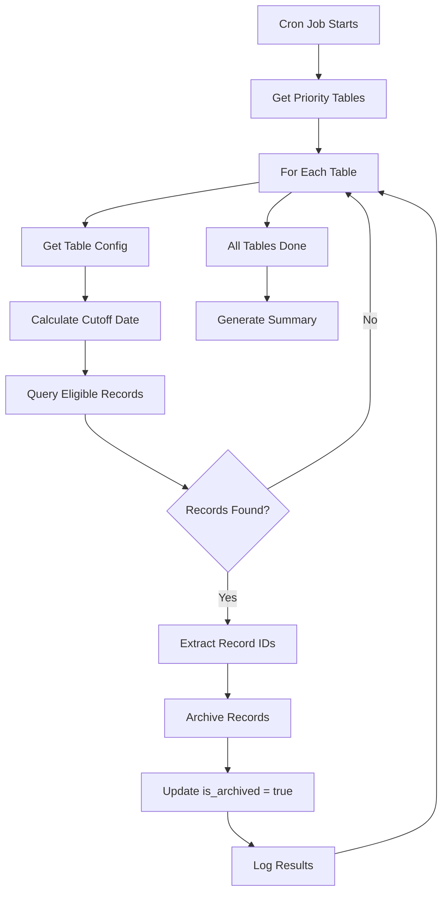

# Archival Cron Job Setup Guide

## 🎯 **AUTOMATIC DATE-BASED ARCHIVAL**

This guide shows how to set up cron jobs that automatically archive records when they exceed their configured retention periods based on the `created_date` attribute.

## ⏰ **CRON SCHEDULE RECOMMENDATIONS**

### **Production Cron Configuration**

Add these entries to your server's crontab (`crontab -e`):

```bash
# Daily Archival - Runs at 2:00 AM UTC (low traffic time)
0 2 * * * cd /path/to/kitchen && /path/to/venv/bin/python -c "from app.services.cron.archival_job import daily_cron_entry; daily_cron_entry()" >> /var/log/kitchen/archival.log 2>&1

# Weekly Validation - Runs Sunday at 3:00 AM UTC
0 3 * * 0 cd /path/to/kitchen && /path/to/venv/bin/python -c "from app.services.cron.archival_job import weekly_validation_entry; weekly_validation_entry()" >> /var/log/kitchen/archival_validation.log 2>&1

# Priority Financial Archival - Runs twice daily for critical financial data
0 6,18 * * * cd /path/to/kitchen && /path/to/venv/bin/python -c "from app.services.cron.archival_job import priority_financial_entry; priority_financial_entry()" >> /var/log/kitchen/financial_archival.log 2>&1

# Dashboard Generation - Runs every 4 hours for monitoring
0 */4 * * * cd /path/to/kitchen && /path/to/venv/bin/python -c "from app.services.cron.archival_job import dashboard_entry; dashboard_entry()" >> /var/log/kitchen/archival_dashboard.log 2>&1
```

### **Development/Testing Cron Configuration**

For testing, you can run more frequently:

```bash
# Test daily archival every hour
0 * * * * cd /path/to/kitchen && /path/to/venv/bin/python app/services/cron/archival_job.py daily >> /tmp/archival_test.log 2>&1

# Test validation every 6 hours
0 */6 * * * cd /path/to/kitchen && /path/to/venv/bin/python app/services/cron/archival_job.py validate >> /tmp/archival_validation_test.log 2>&1
```

## 🔧 **MANUAL EXECUTION FOR TESTING**

### **Command Line Interface**

```bash
# Navigate to project directory
cd /path/to/kitchen

# Activate virtual environment
source venv/bin/activate

# Run daily archival (default: 200 records per table, 15 tables max)
python app/services/cron/archival_job.py daily

# Run daily archival with custom batch sizes
python app/services/cron/archival_job.py daily 100 10

# Run validation
python app/services/cron/archival_job.py validate

# Generate dashboard
python app/services/cron/archival_job.py dashboard

# Run priority archival for specific category
python app/services/cron/archival_job.py priority financial_critical

# Run priority archival with custom batch size
python app/services/cron/archival_job.py priority customer_service 25
```

### **Python Direct Execution**

```python
from app.services.cron.archival_job import (
    run_daily_archival, 
    run_archival_validation, 
    get_archival_dashboard,
    run_priority_archival
)

# Run daily archival
result = run_daily_archival(batch_size=150, max_tables=20)
print(f"Archived {result['total_archived']} records")

# Run validation
validation = run_archival_validation()
print(f"Validation status: {validation['overall_status']}")

# Get dashboard data
dashboard = get_archival_dashboard()
print(f"Total active records: {dashboard['summary']['total_active_records']}")

# Priority archival for financial data
priority_result = run_priority_archival("financial_critical", batch_size=50)
print(f"Priority archival completed: {priority_result['success']}")
```

## 📊 **HOW THE DATE-BASED ARCHIVAL WORKS**

### **Eligibility Calculation**

For each table, the system calculates which records are eligible for archival:

```sql
-- Example for a table with 90-day retention + 7-day grace period
SELECT * FROM plate_pickup_live
WHERE is_archived = false 
  AND created_date < (CURRENT_TIMESTAMP - INTERVAL '97 days')
ORDER BY created_date ASC
LIMIT 200
```

### **Retention Period Lookup**

1. **Check Database Configuration** (if `USE_DATABASE_ARCHIVAL_CONFIG=true`)
   ```sql
   SELECT retention_days, grace_period_days 
   FROM archival_config 
   WHERE table_name = 'plate_pickup_live' AND is_active = true
   ```

2. **Fallback to Code Configuration** (if database config unavailable)
   ```python
   # From app/config/archival_config.py
   TABLE_CATEGORY_MAPPING = {
       "plate_pickup_live": ArchivalCategory.CUSTOMER_SERVICE  # 90 days
   }
   ```

### **Archival Process Flow**



## 🔍 **MONITORING & LOGGING**

### **Log File Locations**

```bash
# Create log directories
sudo mkdir -p /var/log/kitchen
sudo chown $(whoami):$(whoami) /var/log/kitchen

# Log files will be created at:
/var/log/kitchen/archival.log              # Daily archival logs
/var/log/kitchen/archival_validation.log   # Weekly validation logs  
/var/log/kitchen/financial_archival.log    # Priority financial archival
/var/log/kitchen/archival_dashboard.log    # Dashboard generation logs
```

### **Log Analysis**

```bash
# Check recent archival activity
tail -f /var/log/kitchen/archival.log

# Look for errors in the last 24 hours
grep -i "error\|failed" /var/log/kitchen/archival.log | tail -20

# Count archived records per day
grep "records archived" /var/log/kitchen/archival.log | awk '{print $1, $2, $6}' | sort

# Check validation status
grep "overall_status" /var/log/kitchen/archival_validation.log | tail -5
```

### **Monitoring Alerts**

Set up alerts for archival failures:

```bash
# Create monitoring script
cat > /usr/local/bin/check_archival.sh << 'EOF'
#!/bin/bash
LOG_FILE="/var/log/kitchen/archival.log"
ERROR_COUNT=$(grep -c "ERROR\|FATAL" "$LOG_FILE" | tail -1)

if [ "$ERROR_COUNT" -gt 0 ]; then
    echo "ALERT: $ERROR_COUNT archival errors found in last run"
    # Send alert (email, Slack, etc.)
    exit 1
fi

echo "Archival monitoring: OK"
exit 0
EOF

chmod +x /usr/local/bin/check_archival.sh

# Add to cron for monitoring
0 8 * * * /usr/local/bin/check_archival.sh
```

## ⚙️ **CONFIGURATION MANAGEMENT**

### **Environment Variables**

```bash
# Set in your environment or .env file

# Use database configuration (production)
export USE_DATABASE_ARCHIVAL_CONFIG=true

# Keep code configuration (development)
export USE_DATABASE_ARCHIVAL_CONFIG=false

# Database connection for archival jobs
export DB_HOST=localhost
export DB_NAME=kitchen
export DB_USER=kitchen_user
export DB_PASSWORD=your_password
```

### **System User Setup**

```sql
-- Create a dedicated system user for archival operations
INSERT INTO user_info (
    user_id, 
    institution_id, 
    role_id, 
    username, 
    email, 
    hashed_password, 
    first_name, 
    last_name, 
    mobile_number,
    modified_by
) VALUES (
    '00000000-0000-0000-0000-000000000001',  -- Update SYSTEM_USER_ID in archival_job.py
    '44444444-4444-4444-4444-444444444444',  -- System institution
    (SELECT role_id FROM role_info WHERE role_type = 'System' LIMIT 1),
    'archival_system',
    'system+archival@kitchen.com',
    'not_used_for_login',
    'Archival',
    'System',
    '0000000000',
    '11111111-1111-1111-1111-111111111111'
);
```

## 🚨 **TROUBLESHOOTING**

### **Common Issues**

1. **Cron Job Not Running**
   ```bash
   # Check cron service
   sudo systemctl status cron
   
   # Check cron logs
   grep CRON /var/log/syslog | tail -10
   
   # Verify cron job syntax
   crontab -l | grep archival
   ```

2. **Database Connection Errors**
   ```bash
   # Test database connection
   python -c "from app.utils.db import get_db_connection; print('DB OK:', get_db_connection())"
   
   # Check environment variables
   env | grep DB_
   ```

3. **Permission Errors**
   ```bash
   # Fix log file permissions
   sudo chown -R $(whoami):$(whoami) /var/log/kitchen/
   sudo chmod 755 /var/log/kitchen/
   sudo chmod 644 /var/log/kitchen/*.log
   ```

4. **Module Import Errors**
   ```bash
   # Verify Python path
   cd /path/to/kitchen
   python -c "import app.services.cron.archival_job; print('Import OK')"
   
   # Check virtual environment
   which python
   pip list | grep -E "fastapi|psycopg2"
   ```

### **Manual Recovery**

If archival falls behind, run priority recovery:

```bash
# Archive financial data immediately
python app/services/cron/archival_job.py priority financial_critical 500

# Large batch archival for all categories
python app/services/cron/archival_job.py daily 1000 25

# Check what needs archival
python app/services/cron/archival_job.py dashboard | grep eligible_for_archival
```

## 📈 **PERFORMANCE TUNING**

### **Batch Size Guidelines**

| Table Size | Recommended Batch Size | Frequency |
|------------|----------------------|-----------|
| < 10K records | 500 | Daily |
| 10K - 100K | 200-300 | Daily |
| 100K - 1M | 100-200 | Multiple times daily |
| > 1M records | 50-100 | Hourly during off-peak |

### **Optimization Tips**

1. **Run during low-traffic hours** (2-6 AM)
2. **Limit concurrent tables** to avoid database load
3. **Monitor database performance** during archival
4. **Use priority archival** for urgent cleanup
5. **Adjust batch sizes** based on server performance

## 🔄 **DEPLOYMENT CHECKLIST**

- [ ] Set up log directories with proper permissions
- [ ] Configure environment variables
- [ ] Create system user for archival operations
- [ ] Add cron jobs to server crontab
- [ ] Test manual execution of all job types
- [ ] Set up monitoring and alerting
- [ ] Document any custom retention periods
- [ ] Verify database configuration (if using DB config)
- [ ] Test rollback procedures for configuration changes

This setup ensures your archival system runs automatically, maintains audit trails, and can be monitored for reliability! 