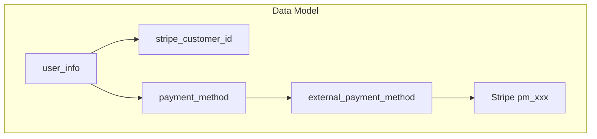

# Stripe Customer Integration Roadmap

**Last Updated**: 2026-03-22  
**Purpose**: Full Stripe integration per customer (Stripe Customer + saved payment methods), with mock endpoints for UI development until live Stripe is ready.

---

## Executive Summary

The app currently uses one-time PaymentIntents for subscription signup. There is no Stripe Customer or saved payment methods. This roadmap adds:

1. **Phase 1 (DONE)**: Mock endpoints for B2C "Manage payment methods" UI development
2. **Phase 2 (DONE)**: Database schema for `stripe_customer_id` and repurposing `payment_method` / `external_payment_method`
3. **Phase 3 (next)**: Live Stripe implementation (Setup Session, webhooks, detach, set default)
4. **Phase 4**: Integration with subscription flow (reuse saved card for with-payment)
5. **Phase 3.5 (Hardening)**: SCA expectations, refunds/disputes, environment key discipline (runs alongside or immediately after Phase 3)

**Stripe test environment:** Test mode is built into the Stripe Dashboard (toggle). Test API keys (`sk_test_…`, publishable test keys) are isolated from live keys (`sk_live_…`); test charges never move real money. Stripe documents test card numbers (e.g. `4242 4242 4242 4242`) and the Stripe CLI can forward webhooks locally (`stripe listen --forward-to …`) — this is the intended way to exercise Phase 3 before production.

---

## Current State vs Target

| Aspect | Current | Target |
|--------|---------|--------|
| Stripe Customer | None | One per user (`stripe_customer_id` on user) |
| Saved payment methods | Not used for B2C | List, add, delete, set default |
| Subscription payment | One-time PaymentIntent per signup | Optionally reuse saved card |
| Payment method management | Generic CRUD (Fintech-deprecated) | Customer-scoped `/api/v1/customer/payment-methods/` |

---

## Phase 1: Mock Endpoints (UI development) — DONE

Mock endpoints enable the B2C app to build "Manage payment methods" screens before live Stripe.

### Endpoints

| Method | Path | Purpose |
|--------|------|---------|
| GET | `/api/v1/customer/payment-methods/` | List saved payment methods |
| POST | `/api/v1/customer/payment-methods/setup-session` | Create Stripe setup session URL |
| DELETE | `/api/v1/customer/payment-methods/{payment_method_id}` | Remove payment method |
| PUT | `/api/v1/customer/payment-methods/{payment_method_id}/default` | Set as default |

### Mock behavior

- **GET**: Return fixture data when no DB rows; otherwise read from `payment_method` + `external_payment_method` for `user_id`
- **POST setup-session**: Return `{ setup_url: "https://mock-stripe-setup.example", expires_at: "..." }`
- **DELETE** / **PUT default**: 200 OK, no-op

### Request/Response contracts

**GET /api/v1/customer/payment-methods/**

Response (200):
```json
{
  "payment_methods": [
    {
      "payment_method_id": "uuid",
      "last4": "4242",
      "brand": "visa",
      "is_default": true,
      "external_id": "pm_xxx"
    }
  ]
}
```

**POST /api/v1/customer/payment-methods/setup-session**

Request (optional): `{ "return_url": "https://yourapp.com/settings/payment" }`

Response (200):
```json
{
  "setup_url": "https://mock-stripe-setup.example",
  "expires_at": "2026-03-04T12:30:00Z"
}
```

**DELETE /api/v1/customer/payment-methods/{payment_method_id}**

Response (200): `{ "detail": "Payment method removed." }`

**PUT /api/v1/customer/payment-methods/{payment_method_id}/default**

Response (200): `{ "detail": "Default payment method updated." }`

### Access control

- Customer role only (`get_client_user`)
- Scoped to `current_user["user_id"]`

---

## Phase 2: Database Changes (DONE)

| Change | Location |
|--------|----------|
| Add `stripe_customer_id VARCHAR(255)` | `user_info` table |
| Add `stripe_customer_id` to `user_history` | Trigger updated |
| Repurpose `payment_method` + `external_payment_method` | Use `method_type = 'Stripe'`, `provider = 'stripe'` |
| Optional: `subscription_info.default_payment_method_id` | For future recurring charges |

Migration checklist:

- [x] `schema.sql`: Add column
- [x] `trigger.sql`: Update user_history trigger
- [x] `dto/models.py`: Add to `UserDTO`
- [x] Mock endpoints: persist data (setup-session sets stripe_customer_id; mock-add creates payment_method + external_payment_method; DELETE archives; PUT default updates)
- [x] Unit tests: `app/tests/database/test_customer_payment_methods.py`
- [x] Postman E2E: `009 CUSTOMER_STRIPE_CONFIG.postman_collection.json`

---

## Phase 3: Live Stripe Implementation

### Implementation requirements (non-negotiable)

| Requirement | Detail |
|-------------|--------|
| **Webhook signature verification** | Every incoming webhook must be verified with `stripe.Webhook.construct_event(payload, stripe_signature_header, STRIPE_WEBHOOK_SECRET)` before trusting or acting on the body. Skipping verification is a common security hole. Do not process JSON from unverified requests. |
| **Idempotency** | Stripe may deliver the same event more than once. Handlers for `payment_method.attached`, `payment_method.detached`, `customer.updated`, and subscription-related events must be idempotent (e.g. check row exists / already archived / payment already applied before mutating state). The existing `payment_intent.succeeded` path should follow the same pattern. |

### Stripe Customer creation (single trigger, no duplicates)

- **Chosen trigger:** Create the Stripe Customer **when starting the setup-session flow** (first call to create a Checkout Setup Session for that user), not ambiguously split across “first payment OR first add card.” That avoids two code paths racing and creating two Stripe customers for one `user_id`.

### Stripe Customer creation — concurrency (PostgreSQL)

Implementers should not leave this as a vague comment; use this concrete pattern:

1. **Uniqueness:** Add `UNIQUE (stripe_customer_id)` on `user_info` during Phase 3 if it is not already in `schema.sql`. In PostgreSQL, `UNIQUE` allows multiple `NULL` rows; each non-null `cus_…` may appear at most once, so one Stripe Customer cannot be linked to two users.
2. **Transaction:** `BEGIN`; `SELECT … FROM user_info WHERE user_id = %s FOR UPDATE` to lock the user row for the duration of the transaction.
3. **Re-check:** If `stripe_customer_id` IS NOT NULL, reuse it: create only the Setup Session (no `stripe.Customer.create()`), `COMMIT`, return.
4. **Create:** If still `NULL`, call `stripe.Customer.create(…)`, then `UPDATE user_info SET stripe_customer_id = … WHERE user_id = %s`, `COMMIT`.

Concurrent setup-session requests for the same user serialize on **`FOR UPDATE`**; the second transaction sees the committed `stripe_customer_id` and skips `Customer.create()`.

### Components

| Component | Description |
|-----------|-------------|
| Create Stripe Customer | On **setup-session start** (see above); persist `stripe_customer_id` on `user_info` after create; never create if already present |
| Setup session | `stripe.checkout.Session.create(mode="setup", customer=stripe_customer_id, …)` — card data stays on Stripe-hosted pages |
| Setup `return_url` | Stripe redirects the user’s browser to `return_url` after setup completes, **cancels**, or abandons (exact query parameters follow [Stripe Checkout session behavior](https://docs.stripe.com/payments/checkout)). **Backend:** pass a stable app URL (and optional query flags your client understands). **Client:** on landing after redirect, **re-fetch** `GET /api/v1/customer/payment-methods/` (and handle empty/partial state while webhooks catch up); do not assume a synchronous API response completes the flow. |
| Webhooks | `payment_method.attached`, `payment_method.detached`, `customer.updated` to sync local tables (verified + idempotent) |
| Delete | Call `stripe.PaymentMethod.detach()`; **soft-delete** local row (see below) |
| Set default | Update `payment_method.is_default`; optionally `stripe.Customer` with `invoice_settings.default_payment_method` |
| Reuse for with-payment | When `stripe_customer_id` and default payment method exist, pre-fill PaymentIntent |

### Removing a payment method (soft delete, not hard delete)

**Archive** means: set **`payment_method.is_archived = TRUE`** on the existing row. The row **stays** in `payment_method` (and linked `external_payment_method`) for referential integrity, history, and correlation with past payments. Update **`modified_by`** and **`modified_date`** per existing app conventions. **Do not** `DELETE` the row unless the product later defines an explicit hard-retention policy.

**List APIs** for B2C “manage cards” return only **`is_archived = FALSE`** rows unless a separate admin or support path is documented.

### PCI scope

Using Stripe-hosted Checkout / Setup Session keeps the platform in the lowest PCI tier (**SAQ A**): raw card data must not touch application servers. This roadmap assumes that pattern; do not add server-side card collection.

---

## Phase 3.5: Hardening (happy path + operations)

Phase 3 covers collection and sync; production and compliance need explicit handling for failures and lifecycle events:

| Topic | Guidance |
|-------|----------|
| **SCA / 3D Secure** | For cards/regions that require Strong Customer Authentication, Stripe handles most of the flow inside Checkout and Setup Sessions. The **client must support redirect / confirmation** flows and must not assume every charge or setup completes synchronously. |
| **Refunds** | Roadmap Phase 3 is charge/setup-centric; define how **refunds** are initiated (admin/support API vs Stripe Dashboard) and how refunded payments surface in your billing/subscription models. Even in test mode, know which Stripe objects update when you refund. |
| **Disputes / chargebacks** | Subscribe to **`charge.dispute.created`** (and related dispute events as needed). Define whether webhooks update internal payment/subscription state, notify ops, or both. |
| **Environment key hygiene** | `STRIPE_SECRET_KEY`, `STRIPE_WEBHOOK_SECRET`, publishable keys, and webhook endpoints must **never** reuse live values in staging/dev or vice versa. Mis-copied live keys into test envs are a common incident source; document per-environment Dashboard webhook endpoints and secrets. |
| **Max saved cards per user** | Stripe does not cap how many payment methods a Customer can hold. The platform should define a limit (e.g. **5** active, non-archived Stripe methods per `user_id`) and **reject** creating a new Setup Session (or surface a clear error) when at cap to limit abuse and UI clutter. |

---

## Phase 4: Subscription Flow Integration

- **with-payment**: If user has `stripe_customer_id` and default payment method, create PaymentIntent with `payment_method=pm_xxx` and `confirm=true` for automatic charge (subject to SCA as above).
- **Renewal**: Currently renewal only updates balance; no card charge. Future: use saved payment method for recurring Stripe charges if needed.

---

## Data Model



---

## Dependencies

- Stripe account (Dashboard **Test mode** for development; separate live credentials for production)
- API keys: `STRIPE_SECRET_KEY` (`sk_test_…` vs `sk_live_…`), `STRIPE_PUBLISHABLE_KEY` (test vs live publishable)
- Webhook signing secret: `STRIPE_WEBHOOK_SECRET` — **one secret per webhook endpoint per environment** (Stripe CLI prints a `whsec_…` for local forwarding; Dashboard provides a different secret for deployed URLs)
- Webhook endpoint: `POST /api/v1/webhooks/stripe` (and any additional routes if events are split by concern)

---

## Testing Strategy

- **Phase 1 (mock)**: Postman collection for GET, POST setup-session, DELETE, PUT default (`009 CUSTOMER_STRIPE_CONFIG.postman_collection.json`)
- **Stripe test cards**: Use [Stripe’s documented test card numbers](https://docs.stripe.com/testing) (e.g. `4242 4242 4242 4242` for successful Visa in test mode); use [test tokens for 3DS / SCA](https://docs.stripe.com/testing#regulatory-cards) when validating European-style flows
- **Phase 3 (live) — CLI forwarding:**  
  `stripe listen --forward-to localhost:8000/api/v1/webhooks/stripe`  
  Use the CLI’s signing secret in `.env` as `STRIPE_WEBHOOK_SECRET` for local verification.
- **Events to exercise with CLI / Dashboard “Send test webhook”** (in addition to existing subscription flows):
  - `payment_method.attached` — sync new PM to DB
  - `payment_method.detached` — archive / remove local row
  - `customer.updated` — default payment method or metadata changes
  - `charge.dispute.created` — once Phase 3.5 dispute handling is implemented

---

## Related Documentation

- [STRIPE_INTEGRATION_HANDOFF.md](../api/internal/STRIPE_INTEGRATION_HANDOFF.md) – Replace mock with live Stripe
- [SUBSCRIPTION_PAYMENT_API.md](../api/b2c_client/SUBSCRIPTION_PAYMENT_API.md) – Atomic subscription + payment flow
