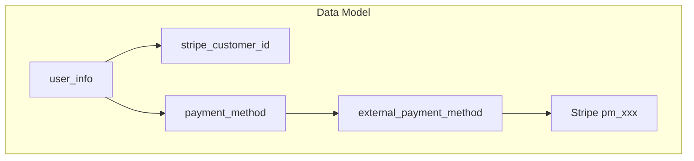

# Stripe Customer Integration Roadmap

**Last Updated**: 2026-03-04  
**Purpose**: Full Stripe integration per customer (Stripe Customer + saved payment methods), with mock endpoints for UI development until live Stripe is ready.

---

## Executive Summary

The app currently uses one-time PaymentIntents for subscription signup. There is no Stripe Customer or saved payment methods. This roadmap adds:

1. **Phase 1 (now)**: Mock endpoints for B2C "Manage payment methods" UI development
2. **Phase 2**: Database schema for `stripe_customer_id` and repurposing `payment_method` / `external_payment_method`
3. **Phase 3**: Live Stripe implementation (Setup Session, webhooks, detach, set default)
4. **Phase 4**: Integration with subscription flow (reuse saved card for with-payment)

---

## Current State vs Target

| Aspect | Current | Target |
|--------|---------|--------|
| Stripe Customer | None | One per user (`stripe_customer_id` on user) |
| Saved payment methods | Not used for B2C | List, add, delete, set default |
| Subscription payment | One-time PaymentIntent per signup | Optionally reuse saved card |
| Payment method management | Generic CRUD (Fintech-deprecated) | Customer-scoped `/api/v1/customer/payment-methods/` |

---

## Phase 1: Mock Endpoints (UI development)

Mock endpoints enable the B2C app to build "Manage payment methods" screens before live Stripe.

### Endpoints

| Method | Path | Purpose |
|--------|------|---------|
| GET | `/api/v1/customer/payment-methods/` | List saved payment methods |
| POST | `/api/v1/customer/payment-methods/setup-session` | Create Stripe setup session URL |
| DELETE | `/api/v1/customer/payment-methods/{payment_method_id}` | Remove payment method |
| PUT | `/api/v1/customer/payment-methods/{payment_method_id}/default` | Set as default |

### Mock behavior

- **GET**: Return fixture data when no DB rows; otherwise read from `payment_method` + `external_payment_method` for `user_id`
- **POST setup-session**: Return `{ setup_url: "https://mock-stripe-setup.example", expires_at: "..." }`
- **DELETE** / **PUT default**: 200 OK, no-op

### Request/Response contracts

**GET /api/v1/customer/payment-methods/**

Response (200):
```json
{
  "payment_methods": [
    {
      "payment_method_id": "uuid",
      "last4": "4242",
      "brand": "visa",
      "is_default": true,
      "external_id": "pm_xxx"
    }
  ]
}
```

**POST /api/v1/customer/payment-methods/setup-session**

Request (optional): `{ "return_url": "https://yourapp.com/settings/payment" }`

Response (200):
```json
{
  "setup_url": "https://mock-stripe-setup.example",
  "expires_at": "2026-03-04T12:30:00Z"
}
```

**DELETE /api/v1/customer/payment-methods/{payment_method_id}**

Response (200): `{ "detail": "Payment method removed." }`

**PUT /api/v1/customer/payment-methods/{payment_method_id}/default**

Response (200): `{ "detail": "Default payment method updated." }`

### Access control

- Customer role only (`get_client_user`)
- Scoped to `current_user["user_id"]`

---

## Phase 2: Database Changes (DONE)

| Change | Location |
|--------|----------|
| Add `stripe_customer_id VARCHAR(255)` | `user_info` table |
| Add `stripe_customer_id` to `user_history` | Trigger updated |
| Repurpose `payment_method` + `external_payment_method` | Use `method_type = 'Stripe'`, `provider = 'stripe'` |
| Optional: `subscription_info.default_payment_method_id` | For future recurring charges |

Migration checklist:

- [x] `schema.sql`: Add column
- [x] `trigger.sql`: Update user_history trigger
- [x] `dto/models.py`: Add to `UserDTO`
- [x] Mock endpoints: persist data (setup-session sets stripe_customer_id; mock-add creates payment_method + external_payment_method; DELETE archives; PUT default updates)
- [x] Unit tests: `app/tests/database/test_customer_payment_methods.py`
- [x] Postman E2E: `009 CUSTOMER_STRIPE_CONFIG.postman_collection.json`

---

## Phase 3: Live Stripe Implementation

| Component | Description |
|-----------|-------------|
| Create Stripe Customer | On first payment or first "add payment method"; store `stripe_customer_id` on user |
| Setup session | `stripe.checkout.Session.create(mode="setup", customer=stripe_customer_id, ...)` |
| Webhooks | `payment_method.attached`, `payment_method.detached`, `customer.updated` to sync local tables |
| Delete | Call `stripe.PaymentMethod.detach()`; archive local row |
| Set default | Update `payment_method.is_default`; optionally `stripe.Customer(invoice_settings={default_payment_method})` |
| Reuse for with-payment | When `stripe_customer_id` and default payment method exist, pre-fill PaymentIntent |

---

## Phase 4: Subscription Flow Integration

- **with-payment**: If user has `stripe_customer_id` and default payment method, create PaymentIntent with `payment_method=pm_xxx` and `confirm=true` for automatic charge.
- **Renewal**: Currently renewal only updates balance; no card charge. Future: use saved payment method for recurring Stripe charges if needed.

---

## Data Model



---

## Dependencies

- Stripe account (test and live)
- API keys: `STRIPE_SECRET_KEY`, `STRIPE_PUBLISHABLE_KEY`
- Webhook signing secret: `STRIPE_WEBHOOK_SECRET`
- Webhook endpoint: `POST /api/v1/webhooks/stripe`

---

## Testing Strategy

- **Phase 1 (mock)**: Postman collection for GET, POST setup-session, DELETE, PUT default
- **Phase 3 (live)**: Stripe CLI `stripe listen --forward-to localhost:8000/api/v1/webhooks/stripe`

---

## Related Documentation

- [STRIPE_INTEGRATION_HANDOFF.md](../api/internal/STRIPE_INTEGRATION_HANDOFF.md) – Replace mock with live Stripe
- [SUBSCRIPTION_PAYMENT_API.md](../api/b2c_client/SUBSCRIPTION_PAYMENT_API.md) – Atomic subscription + payment flow
